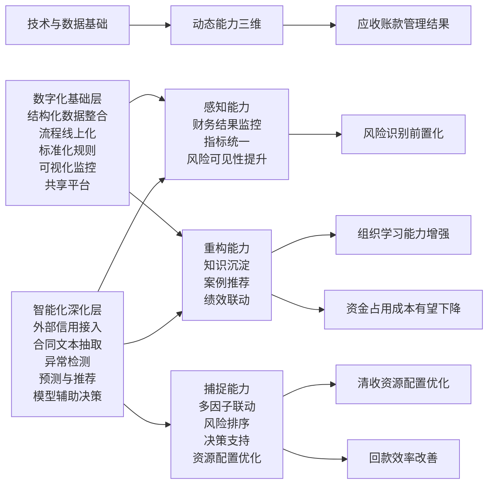

# 文献综述与理论模型草稿

适用论文：《动态能力视角下财务智能化赋能应收账款管理研究——以A公司为例》

本文档包含三部分内容：
- 扩充后的文献池
- 可直接放入论文的文献综述草稿
- “动态能力理论赋能应收账款管理”的理论模型草稿

## 一、扩充后的建议文献池

### 1. 动态能力与数字化转型

1. Teece, D. J. (2007). *Explicating dynamic capabilities: the nature and microfoundations of (sustainable) enterprise performance*. Strategic Management Journal, 28(13), 1319-1350.  
DOI: https://doi.org/10.1002/smj.640

2. Ellström, D., Holtström, J., Berg, E., & Josefsson, C. (2022). *Dynamic capabilities for digital transformation*. Journal of Strategy and Management, 15(2), 272-286.  
DOI: https://doi.org/10.1108/JSMA-04-2021-0089

3. Mikalef, P., van de Wetering, R., & Krogstie, J. (2021). *Building dynamic capabilities by leveraging big data analytics: The role of organizational inertia*. Information & Management, 58(6), 103412.  
DOI: https://doi.org/10.1016/j.im.2020.103412

4. Dehbi, S., Lamrani, H. C., Belgnaoui, T., & Lafou, T. (2022). *Big Data Analytics and Management control*. Procedia Computer Science, 203, 438-443.  
DOI: https://doi.org/10.1016/j.procs.2022.07.058

5. Phan, T., & Baird, K. (2026). *The use of big data analytics in performance management: the antecedents and role in enhancing performance measurement system effectiveness*. Journal of Management Control.  
链接: https://link.springer.com/article/10.1007/s00187-026-00414-2

### 2. 财务数字化、智能化与 AI in Accounting

6. Möller, K., Schäffer, U., & Verbeeten, F. (2020). *Digitalization in management accounting and control: an editorial*. Journal of Management Control, 31, 1-8.  
DOI: https://doi.org/10.1007/s00187-020-00300-5

7. Leitner-Hanetseder, S., Lehner, O. M., Eisl, C., & Forstenlechner, C. (2021). *A profession in transition: actors, tasks and roles in AI-based accounting*. Journal of Applied Accounting Research, 22(3), 539-556.  
DOI: https://doi.org/10.1108/JAAR-10-2020-0201

8. Ding, K., Lev, B., Peng, X., Sun, T., & Vasarhelyi, M. A. (2020). *Machine learning improves accounting estimates: evidence from insurance payments*. Review of Accounting Studies, 25, 1098-1134.  
DOI: https://doi.org/10.1007/s11142-020-09546-9

9. Fedyk, A., Hodson, J., Khimich, N., & Fedyk, T. (2022). *Is artificial intelligence improving the audit process?* Review of Accounting Studies, 27, 938-985.  
DOI: https://doi.org/10.1007/s11142-022-09697-x

10. Zhang, M. (张敏). (2021). 智能财务十大热点问题论[J]. 财会月刊, (02), 25-30.  
CNKI 线索: https://ckyk.cbpt.cnki.net/WKG/WebPublication/wkTextContent.aspx?colType=4&st=02&yt=2021

### 3. 文本挖掘、非结构化数据与文档智能

11. Senave, E., Jans, M. J., & Srivastava, R. P. (2023). *The application of text mining in accounting*. International Journal of Accounting Information Systems, 50, 100624.  
DOI: https://doi.org/10.1016/j.accinf.2023.100624

12. Mahadevkar, S. V., Patil, S., Kotecha, K., et al. (2024). *Exploring AI-driven approaches for unstructured document analysis and future horizons*. Journal of Big Data, 11, 92.  
DOI: https://doi.org/10.1186/s40537-024-00948-z

13. Moore, W. R., & van Vuuren, J. H. (2024). *A framework for modelling customer invoice payment predictions*. Machine Learning with Applications, 17, 100578.  
DOI: https://doi.org/10.1016/j.mlwa.2024.100578

14. 李可童, 陈力. (2019). 数据挖掘技术在管理会计中的应用: 基于破产风险预警视角[J]. 深圳信息职业技术学院学报, 17(03), 74-78.  
CNKI/期刊入口线索: https://szxz.cbpt.cnki.net/portal/journal/portal/client/paper/a8b03ffee973336f47b327e6160adba5

### 4. 信用风险、异常检测与可解释 AI

15. Shi, S., Tse, R., Luo, W., D’Addona, S., & Pau, G. (2022). *Machine learning-driven credit risk: a systemic review*. Neural Computing and Applications, 34, 14327-14339.  
DOI: https://doi.org/10.1007/s00521-022-07472-2

16. Bussmann, N., Giudici, P., Marinelli, D., & Papenbrock, J. (2021). *Explainable Machine Learning in Credit Risk Management*. Computational Economics, 57, 203-216.  
DOI: https://doi.org/10.1007/s10614-020-10042-0

17. Černevičienė, J., & Kabašinskas, A. (2024). *Explainable artificial intelligence (XAI) in finance: a systematic literature review*. Artificial Intelligence Review, 57, 216.  
DOI: https://doi.org/10.1007/s10462-024-10854-8

18. Yeo, W. J., Van Der Heever, W., Mao, R., Cambria, E., Satapathy, R., & Mengaldo, G. (2025). *A comprehensive review on financial explainable AI*. Artificial Intelligence Review, 58, 189.  
链接: https://link.springer.com/article/10.1007/s10462-024-11077-7

19. Sabharwal, R., Miah, S. J., Wamba, S. F., et al. (2025). *Extending application of explainable artificial intelligence for managers in financial organizations*. Annals of Operations Research, 354, 309-339.  
DOI: https://doi.org/10.1007/s10479-024-05825-9

20. Alonso Robisco, A., & Carbó Martínez, J. M. (2022). *Measuring the model risk-adjusted performance of machine learning algorithms in credit default prediction*. Financial Innovation, 8, 70.  
DOI: https://doi.org/10.1186/s40854-022-00366-1

## 二、文献综述草稿

### 2.1 财务智能化相关研究

现有研究表明，数字技术已深刻改变财务与管理会计的运行逻辑，但“数字化”与“智能化”并不能简单等同。Möller、Schäffer 与 Verbeeten（2020）指出，数字化正在重塑管理会计与控制实践，其典型表现包括流程自动化、机器人化、商业智能工具和数据分析能力的引入。这说明在财务管理场景中，数字化首先体现为结构化数据整合、流程线上化、规则嵌入以及信息可视化等基础能力建设。Leitner-Hanetseder 等（2021）进一步从职业分工与任务重构角度指出，AI 导向的会计实践将改变财务岗位的角色结构和能力要求，表明智能化不仅是工具变化，更会引起任务分工和组织协作方式的调整。

在此基础上，财务智能化可被理解为数字化进一步深化的阶段。与主要依赖结构化字段和预设规则的数字化相比，智能化更强调对复杂信息的识别、预测、推荐和辅助判断能力。Ding 等（2020）发现，机器学习可以改善会计估计的准确性，说明算法工具已开始进入会计判断和财务估计领域。Fedyk 等（2022）则在审计场景中指出，人工智能能够在提升效率的同时改进信息处理质量，但其价值实现高度依赖技术与流程的协同。国内研究也已开始将“智能财务”视为独立于传统财务信息化的研究议题。张敏（2021）指出，智能财务不仅涉及自动化处理，更涉及财务职能升级、数据应用深化与管理决策方式变化。

综合上述研究可以发现，财务数字化更侧重于结构化数据整合、标准化流程和规则导向处理，而财务智能化则进一步表现为利用算法、模型和人工智能技术，对非结构化信息和复杂管理情境进行识别、预测、推荐与辅助决策。由此，数字化和智能化之间并不是简单替代关系，而是渐进递进关系：前者解决“数据是否可得、流程是否统一、指标是否可视”，后者进一步解决“复杂信息能否理解、风险是否可提前识别、决策是否可被更精准支持”。

### 2.2 应收账款管理与智能识别相关研究

既有应收账款管理研究主要围绕信用政策、账龄控制、催收机制、内部控制和坏账风险等主题展开，强调应收账款管理对企业现金流安全和经营绩效的重要性。在传统研究框架下，应收账款风险判断更多依赖结构化财务指标和人工经验判断。然而，随着机器学习和文本处理技术的发展，越来越多研究开始尝试将信用风险识别、逾期付款预测和异常行为检测引入应收账款或相近场景。

Shi 等（2022）系统回顾了机器学习在信用风险管理中的应用，指出机器学习和深度学习方法在风险识别精度方面相较传统统计方法具有明显潜力，但同时面临数据不平衡、模型透明度不足和数据集不一致等问题。Bussmann 等（2021）进一步提出，在信用风险管理中，仅有预测结果并不足以支撑管理实践，模型的可解释性直接影响管理者对结果的理解、信任和采用意愿。Černevičienė 与 Kabašinskas（2024）以及 Yeo 等（2025）的综述也表明，在金融场景中，可解释人工智能已成为风险识别和决策支持的重要研究方向，其核心不只是提高预测能力，更在于让管理者能够理解模型为何得出特定结论。

具体到应收账款或发票支付场景，Moore 与 van Vuuren（2024）提出了客户发票付款预测框架，指出企业可以利用历史行为特征、时间到付款的建模以及机器学习方法，更早识别可能延迟付款的应收项目，从而更有效地安排干预策略。该研究特别强调，应收账款管理不仅存在坏账风险，也存在资金占用和管理成本增加问题，因此预测性识别工具具有直接的管理价值。国内研究方面，李可童、陈力（2019）指出，数据挖掘技术在管理会计中的风险预警功能具有较强应用前景，为管理决策提供了新的技术路径。

由此可见，应收账款管理正在从“基于静态财务结果的事后控制”转向“基于多源数据的前置识别和辅助决策”。不过，现有研究大多集中于金融机构信用风险、借贷违约或一般支付预测场景，对建筑企业应收账款管理这种兼具合同复杂性、项目周期长和多部门协同特点的场景关注相对不足。

### 2.3 文本挖掘、非结构化数据与财务管理研究

财务管理中的许多关键风险并不完全体现在结构化字段中，而是隐含于合同文本、补充协议、验收文件、影像资料和管理说明等非结构化信息中。Senave、Jans 与 Srivastava（2023）指出，文本挖掘在会计中的应用价值在于，它能够从非结构化文本中提取知识，并对传统定量数据进行补充、解释和验证。这说明，如果仅依赖金额、账龄和结算状态等结构化变量，管理者很可能遗漏付款条件、确权前提、违约责任和争议条款等真正影响回款的关键信息。

从技术实现角度看，Mahadevkar 等（2024）系统总结了 OCR、命名实体识别、信息抽取、语义分析和大语言模型在非结构化文档处理中的应用，指出这类技术能够将原本只能依赖人工逐份阅读的文档转化为结构化、可索引的信息资源。由此，合同文本、验收资料和影像单据等内容就不再只是“档案”，而可以成为管理系统中的可计算输入。对于应收账款管理而言，这意味着企业有可能在合同签订和履约审核阶段就识别付款节点、确权条件和违约风险，将风险识别前移。

因此，从已有研究看，文本挖掘和文档智能技术为应收账款管理由数字化向智能化演进提供了关键支撑。数字化阶段能够帮助企业整合结构化数据并形成可视化管理界面，智能化阶段则通过对非结构化信息的识别和利用，进一步增强企业的风险感知和辅助判断能力。

### 2.4 动态能力与数字技术融合研究

动态能力理论强调企业在不确定环境中，通过感知、捕捉与重构来实现资源配置与能力更新。Teece（2007）将动态能力概括为 sensing、seizing 和 reconfiguring 三个维度，并指出其背后依赖一系列组织流程、规则和微观基础。对于企业数字化转型而言，这一理论具有较强解释力。Ellström 等（2022）明确指出，动态能力可以用于理解企业数字化转型中如何识别数字机会、制定数字战略并重构基础设施。Mikalef 等（2021）则发现，大数据分析能力能够支撑动态能力的形成，但技术能力并不会自动转化为组织能力，其间还受到组织惯性、制度承接和流程适配的影响。

进一步看，管理控制研究也开始关注大数据与绩效管理之间的关系。Dehbi 等（2022）指出，大数据分析有助于提升管理控制和绩效测量系统的有效性，尤其是当企业能够同时整合内部与外部数据、结构化与非结构化数据时，管理层将获得更强的分析支持。Phan 与 Baird（2026）进一步表明，大数据分析在绩效管理中的使用，与高层支持、员工赋权和绩效测量系统有效性存在显著关联，说明技术应用成效最终仍取决于组织机制。

据此可见，在数字化和智能化背景下，技术并非简单作为工具存在，而是通过影响企业的感知能力、捕捉能力和重构能力，间接作用于管理绩效。这为本文将动态能力理论引入应收账款管理分析提供了明确的理论基础。

### 2.5 文献述评

综上，现有研究已从不同角度揭示了财务数字化、会计智能化、文本挖掘、信用风险识别与可解释人工智能的重要价值，也为本文提供了三方面启示。第一，数字化与智能化并非同一概念。数字化主要解决结构化数据整合、流程线上化、规则嵌入和可视化呈现问题，而智能化则进一步强调对非结构化信息的识别、预测、推荐和辅助决策。第二，动态能力理论能够较好解释企业如何借助数据与技术能力形成感知、捕捉与重构能力，从而推动管理能力升级。第三，在应收账款管理场景中，文本挖掘、信用风险建模和可解释人工智能等技术，为风险识别前置化、资源配置优化和组织学习能力增强提供了现实工具。

但现有研究仍存在明显不足。一方面，关于建筑企业应收账款管理的研究仍更多停留在传统控制逻辑上，对于“由数字化走向智能化”的过程机制讨论不足。另一方面，现有文献虽分别讨论了数字化转型、智能识别和动态能力，却较少将“技术与数据基础—动态能力形成—应收账款管理结果”作为统一链条加以分析。基于此，本文拟在动态能力视角下，区分数字化基础与智能化深化，构建应收账款管理能力升级的理论模型，并据此分析 A 公司实践的现实基础、存在问题与优化路径。

## 三、动态能力理论赋能应收账款管理的理论模型

### 3.1 模型构建逻辑

应收账款管理的复杂性不仅源于金额规模，更源于风险生成和传导过程具有动态性。建筑企业的应收账款管理同时受到客户资信变化、合同条款差异、项目履约进度、监管政策收紧以及组织协同效率等因素影响。传统基于静态账龄和人工经验的管理方式，难以应对这种高动态、高复杂度场景。因此，本文引入动态能力理论，并结合数字化、智能化相关研究，构建“技术与数据基础—动态能力三维—应收账款管理结果”的理论模型。

在该模型中，企业能力形成的基础并非单一技术工具，而是两类层层递进的能力条件：其一是数字化基础层，强调结构化数据整合、流程线上化、标准化规则、共享平台和可视化监控；其二是智能化深化层，强调外部数据接入、合同文本抽取、异常检测、预测与推荐以及模型辅助决策。数字化基础解决的是数据可得性、一致性与及时性问题，智能化深化则进一步解决复杂信息处理和辅助判断问题。

在动态能力层面，上述两类能力条件分别并共同作用于感知、捕捉和重构三个维度。感知能力表现为企业从内部财务结果监控扩展到对外部信用信号、合同文本信息和行为异常的多源识别；捕捉能力表现为企业从规则触发和人工研判扩展到多因子联动、异常识别和资源配置优化；重构能力表现为企业从岗位分工和流程重组扩展到知识沉淀、案例推荐和绩效机制联动。最终，这些能力变化将作用于应收账款管理结果，体现在风险识别前置化、清收资源配置优化、回款效率改善、组织学习能力增强以及资金占用成本下降等方面。

### 3.2 理论模型图

### 3.3 模型解释文本

第一，数字化基础层主要通过提升结构化数据的可得性、一致性和及时性，支撑企业形成基础性的感知能力。财务共享、数据湖、自助宽表和可视化看板使集团能够更及时地看到应收账款规模、账龄结构、客户分布和单位完成情况，从而从原来的“人工逐级报送”转向“系统化实时感知”。

第二，智能化深化层使企业能够处理传统数字化难以覆盖的复杂信息，并由此推动感知能力向更高层次升级。外部信用数据接入可以帮助企业识别客户资信变化，合同文本抽取可以识别付款节点和确权条件，异常检测可以帮助企业识别回款节奏偏离常态的信号。这意味着应收账款管理不再停留于“看见账龄结果”，而是开始进入“理解风险形成机制”的阶段。

第三，感知能力只有进一步转化为决策与行动，才能表现为捕捉能力。规则预警、多因子联动和异常检测等机制，使企业能够更有针对性地排序风险、安排清收资源、筛选优质账款并支持供应链金融变现。此时，系统的价值不只在于报表展示，而在于辅助管理者作出更高质量的判断。

第四，技术应用若要长期发挥作用，还必须通过组织和制度嵌入形成重构能力。流程优化、岗位协同、催收案例沉淀、相似案例推荐以及资金成本导向绩效机制，能够帮助企业把一次性技术应用转化为可持续组织能力。这一维度决定了企业能否避免“系统上线了，但管理方式没变”的常见问题。

### 3.4 研究命题写法建议

如果你想把模型写得更像论文里的理论分析，而不是纯图示，可以在文中加入以下命题式表述：

- 命题 1：数字化基础层通过提升结构化数据整合、流程线上化和指标统一程度，增强企业对应收账款管理风险的基础性感知能力。
- 命题 2：智能化深化层通过引入外部信用数据、文本识别、异常检测与预测推荐机制，推动企业感知能力由结果监控走向前置识别，并提升捕捉能力的精准性。
- 命题 3：感知能力的增强只有在资源配置、清收策略和供应链金融决策中得到转化时，才能表现为应收账款管理的捕捉能力。
- 命题 4：知识沉淀、案例推荐和绩效联动等制度安排，是技术应用转化为组织级重构能力的关键条件。
- 命题 5：数字化基础与智能化深化通过影响感知、捕捉和重构能力，最终作用于风险识别前置化、回款效率改善、组织学习能力增强和资金占用成本下降等结果变量。

## 四、落地建议

建议你按下面顺序往论文里替换：

1. 先用“2.1-2.5 文献综述草稿”替换第1章相关综述。
2. 再把“3.1-3.3 理论模型”放到第2章新增一节“研究分析框架/理论模型构建”。
3. 最后把“3.4 研究命题写法建议”中的句子揉进第2章结尾或第4章开头。

## 五、说明

- 本稿中的英文文献均已尽量采用正式来源或 DOI 链接核验。
- 中文文献目前仍以补充国内研究现状为主，若你后续需要，我可以继续专门补一版中文文献池，重点找知网可引用的“智慧财务、财务共享、管理会计、应收账款风控”文献。
