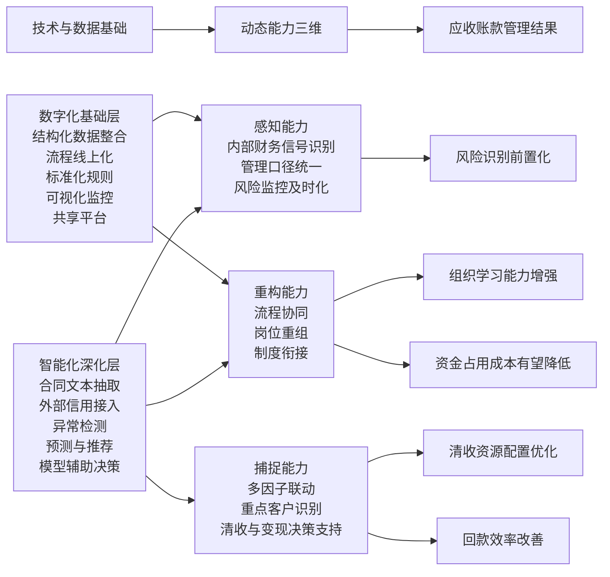

# 论文二轮修改稿

适用对象：基于《动态能力视角下财务智能化赋能应收账款管理研究——以A公司为例》的二轮修改。

使用方式：本稿不是简单提纲，而是可直接拆分替换进正文的修改文本。建议优先替换摘要、文献综述、理论基础中的“理论适用/分析框架”、第4章开头、第5章总判断、第6章方案写法，以及第7章对效果验证边界的表述。

## 一、总定位调整

本文拟将 A 公司应收账款管理实践重新界定为“由数字化走向智能化的过渡性实践”。具体而言，A 公司已经完成了应收账款管理所需的数据整合、流程线上化、标准口径统一、可视化监控和共享化处理等数字化基础建设，并在高风险预警、客户画像、管理穿透等场景中呈现出一定的智能化延伸趋势。但从严格意义上看，企业当前对应收账款的识别、预测、推荐和辅助决策能力仍处于深化阶段，尚未形成成熟、稳定、闭环的智能化管理体系。基于此，本文不再将 A 公司界定为“财务智能化已经成熟落地”的典型样本，而是将其视为建筑企业应收账款管理从数字化迈向智能化的代表性案例，进而分析这一升级过程如何在动态能力框架下影响企业的感知、捕捉与重构能力。

## 二、摘要替换稿

在经济周期调整、国资监管持续强化以及企业财务管理加速转型的背景下，建筑企业应收账款管理面临回收周期长、风险识别滞后和管理协同不足等多重挑战。与此相应，财务管理正在由以流程线上化和数据可视化为代表的数字化阶段，逐步向以识别、预测、推荐和辅助决策能力增强为特征的智能化阶段演进。如何理解这一演进过程，并解释其对应收账款管理能力的影响机制，成为当前建筑企业财务转型中的重要问题。

本文以动态能力理论中的“感知—捕捉—重构”框架为主线，采用案例研究方法，对 A 公司应收账款管理实践进行分析。研究发现：第一，A 公司已通过财务共享、数据湖、自助宽表、指标地图和可视化看板等建设，形成了应收账款管理的数字化基础，从而提升了集团层面对数据的及时获取、统一理解和穿透监管能力。第二，这些基础建设虽为智能化发展创造了条件，但企业当前对应收账款管理的主要能力仍表现为结构化数据驱动、规则嵌入和人工判断支持的数字化强化形态，尚未形成成熟的智能化管理体系。具体而言，在感知维度，外部信用数据与合同文本等非结构化信息尚未充分纳入主系统；在捕捉维度，风险识别仍主要依赖阈值规则与人工研判，缺少多因子联动和异常检测；在重构维度，催收经验沉淀、相似案例推荐和绩效联动机制仍然不足。第三，应收账款管理由数字化走向智能化的关键，在于以多源数据和算法工具推动感知能力前置化、捕捉能力精准化以及重构能力制度化。

基于上述分析，本文构建了“技术与数据基础—动态能力三维—应收账款管理结果”的分析模型，并提出三方面优化路径：一是接入外部信用数据并引入合同文本抽取机制，增强智能感知；二是构建“规则预警—多因子联动—异常检测”三层机制，提升智能捕捉；三是建立催收案例库、相似案例推荐和资金成本导向绩效机制，推进智能重构。本文的意义在于：在动态能力视角下，将建筑企业应收账款管理中的数字化基础与智能化深化区分开来，进而解释财务管理能力升级的中间机制，并为同类企业提供可操作的转型思路。

关键词：财务智能化；数字化转型；动态能力；应收账款管理；建筑企业

## 三、文献综述替换稿

### 3.1 财务智能化的界定与演进

现有研究普遍认为，数字化已深刻影响管理会计与财务管理实践。Möller、Schäffer 与 Verbeeten（2020）指出，数字化不仅改变企业整体经营与商业模式，也改变管理会计与控制实践，其在财务职能中的直接表现包括流程自动化、机器人化、商业智能应用和数据分析能力增强。由此可见，财务数字化首先体现为结构化数据整合、流程线上化、规则嵌入和可视化呈现等能力建设。

在此基础上，财务智能化并不等同于一般意义上的信息化或数字化，而是在数字化底座上进一步引入模型、算法与人工智能，使系统具备更强的识别、预测、推荐与辅助决策能力。Sabharwal 等（2025）指出，AI 在金融组织中的价值不仅来自算法本身，更来自其对异常识别、数据驱动决策和管理理解能力的增强。Mahadevkar 等（2024）则进一步表明，OCR、信息抽取、命名实体识别、语义理解和大语言模型等技术使非结构化文档能够转化为可处理的信息资源，为组织开展文本识别和复杂判断提供了新的技术路径。

据此，本文据文献归纳认为：数字化阶段以结构化数据、流程标准化、规则嵌入、自动化处理和可视化呈现为主要特征；智能化阶段则进一步处理非结构化信息，并借助模型、算法或 AI 技术实现识别、预测、推荐和辅助决策。在本文的应收账款管理场景中，这一差异具体表现为“规则导向的结构化处理”与“文本、行为和多源信号驱动的识别与判断增强”。

### 3.2 应收账款管理研究的拓展方向

既有应收账款研究多聚焦于信用政策、账龄管理、催收机制、内部控制和行业风险等主题，对建筑企业回款周期长、债权确权复杂和资金占用高的特点已有较多讨论。但从技术应用角度看，现有研究更多停留在信息化、共享化和可视化层面，对于如何将外部信用信号、合同文本、行为异常和历史案例纳入管理流程，从而实现更具预测性和决策支持性的应收账款管理，仍缺乏深入分析。

这意味着，在建筑企业应收账款场景中，真正值得进一步讨论的问题，不是“是否已经上线了系统”，而是系统是否能够将结构化数据之外的复杂信息转化为可决策资源，并据此前置风险识别、优化清收资源配置和降低资金占用成本。

### 3.3 动态能力与数字技术融合研究

动态能力理论强调企业在不确定环境中持续感知机会与威胁、捕捉价值并重构资源配置的能力。Teece（2007）将其概括为 sensing、seizing 和 reconfiguring 三类能力，并指出这些能力依赖于组织的流程、结构、规则和决策机制。Mikalef、van de Wetering 与 Krogstie（2021）进一步发现，大数据分析能力能够通过促进感知、捕捉与转型能力的形成，支撑企业的动态能力建设。

从信息形态看，结构化数据分析主要支持企业形成更稳定、更及时的监控与反馈能力，而文本挖掘、OCR 和语义理解等工具则使组织能够处理以往难以纳入管理系统的非结构化信息。Senave、Jans 与 Srivastava（2023）指出，文本挖掘正在成为会计研究和会计实践的重要工具，能够从财务报告、审计文本和其他文本资料中识别有价值的信息。这为本文讨论“数字化基础如何向智能化深化过渡”提供了方法层面的支持。

### 3.4 文献述评替换稿

综上，现有研究为本文提供了三方面启示：第一，财务数字化与财务智能化并非同一概念，二者在数据形态、处理逻辑和管理输出上存在层次差异；第二，动态能力理论能够较好解释企业如何通过技术工具提升环境感知、决策捕捉与组织重构能力；第三，OCR、文本挖掘和 AI 等技术为财务管理处理非结构化信息、提升辅助判断能力提供了现实基础。

但与此同时，现有研究仍存在两方面不足：一是对建筑企业应收账款管理这一高复杂度场景中“从数字化走向智能化”的过程机制分析不足；二是缺少将“技术与数据基础—动态能力形成—管理绩效变化”串联起来的系统性解释。基于此，本文拟在动态能力视角下，区分应收账款管理的数字化基础与智能化深化，并构建相应的理论分析框架。

## 四、理论适用与新增分析框架

### 4.1 动态能力理论适用性替换稿

应收账款管理并非静态管理活动，而是一个同时受客户资信、项目进度、合同条款、宏观政策和组织协同影响的动态过程。特别是在建筑行业，合同资产、长期应收款、票据与现金回款等多类债权并存，项目周期长、责任链条长、确权过程复杂，决定了企业难以依靠单一静态规则完成全过程管理。由此，应收账款管理能力的关键，不仅在于能否获取数据，更在于能否持续识别风险、快速转化为行动并将经验沉淀为组织能力。

动态能力理论能够为这一过程提供更合适的解释框架。Teece（2007）指出，企业动态能力包括感知、捕捉与重构三类能力，其中感知强调对内外部环境变化的识别与解释，捕捉强调基于信号开展资源配置与行动选择，重构强调通过流程、结构和制度调整实现能力升级。对于应收账款管理而言，感知能力对应的是企业能否及时整合财务、业务、客户和外部环境信号；捕捉能力对应的是企业能否基于这些信号识别重点风险、优化催收和融资决策；重构能力对应的是企业能否通过共享化、知识沉淀和绩效联动形成持续改进机制。

进一步看，数字技术并不直接等同于动态能力，而是动态能力形成的重要支撑条件。结构化数据整合、自助宽表、指标地图和可视化看板等建设，提升了企业的信息可得性和一致性，为感知能力奠定基础；外部信用接入、合同文本抽取、异常检测和案例推荐等智能化手段，则使系统具备更强的识别、预测和辅助判断能力，从而推动感知、捕捉和重构能力向更高层次演化。因此，本文将 A 公司的应收账款管理实践理解为：企业以数字化基础建设为起点，在部分场景中向智能化延伸，并在这一过程中逐步塑造动态能力。

### 4.2 新增“研究分析框架/理论模型构建”一节

基于前述文献与理论分析，本文构建“技术与数据基础—动态能力三维—应收账款管理结果”的分析框架，如图所示。

在该框架中，数字化基础层强调企业对结构化信息的整合、统一和展示能力，其主要作用是解决“看见数据、看懂数据、及时获取数据”的问题；智能化深化层则进一步处理合同文本、客户行为和外部信用等非结构化或多源信息，并通过规则之外的模型、算法与 AI 技术提高识别与判断能力。二者并非相互替代，而是层层递进：数字化基础解决数据可得性与管理一致性问题，智能化深化解决复杂信息处理和辅助决策问题。

映射到动态能力框架中，感知能力从结构化财务数据感知升级为多源信号感知，捕捉能力从规则触发和人工判断升级为多因子联动、异常识别和决策支持，重构能力从流程重组和岗位调整升级为知识沉淀、案例推荐和绩效机制联动。最终，这些能力变化将作用于应收账款管理结果，表现为风险识别前置化、清收资源配置优化、回款效率改善、组织学习能力增强以及资金占用成本有望下降。

## 五、第4章开头与边界重写稿

### 5.1 第4章总引导段替换稿

本章不再将 A 公司视为“已经完成财务智能化转型”的案例，而是将其界定为“已经形成较强数字化基础，并在部分场景中出现智能化萌芽”的案例。换言之，A 公司当前的应收账款管理能力，主要建立在共享化、标准化、数据整合、指标统一和管理穿透等数字化基础之上；而更具代表性的智能化能力，如合同文本自动识别、异常行为检测、相似案例推荐和预测性决策支持，仍处于起步或待深化阶段。

因此，本章的重点不在于证明 A 公司已经实现了完全意义上的智能化管理，而在于分析其现有技术与数据基础如何支撑动态能力形成，并为后续智能化深化提供组织和流程条件。相应地，本章按照“数字化基础支撑感知能力”“过渡性捕捉能力的形成”“组织与流程重构为智能化提供条件”的逻辑展开。

### 5.2 建议调整后的章节标题

- 4.1 数字化基础如何支撑应收账款管理的感知能力
- 4.2 从规则处理到辅助决策的过渡性捕捉能力
- 4.3 组织与流程重构如何为智能化深化提供条件

### 5.3 第4章结尾判断句

总体而言，A 公司当前更适合被界定为“数字化强化的应收账款管理实践”。其核心成果在于通过共享化、标准化和数据穿透显著提升了信息透明度、监控及时性和流程一致性，并为后续智能化深化奠定了可靠的数据和组织基础；但如果以非结构化信息处理、预测识别、智能推荐和模型辅助决策等标准衡量，其智能化能力仍未成熟。

## 六、第5章总判断替换稿

基于前文分析，A 公司当前的应收账款管理虽已具备较强的数字化底座，但尚未形成成熟的智能化管理体系。其主要表现为：在感知维度，系统仍以内部结构化财务数据为主，外部信用数据、合同文本和行为类信号尚未充分进入主系统；在捕捉维度，风险识别主要依赖阈值规则和人工研判，缺乏多因子联动和异常检测机制；在重构维度，催收经验仍然更多附着于个体，案例沉淀、智能推荐和绩效联动机制尚未闭环。这意味着，A 公司现阶段更接近“数字化强化的应收账款管理”，而非成熟的“智能化应收账款管理”。第六章的优化重点，也应当从“继续堆砌技术概念”转向“围绕现实问题，推动数字化基础向智能化能力转化”。

## 七、第6章重写稿

### 7.1 写法说明

第6章建议全部改成“输入数据—处理机制—管理输出—预期价值”的写法。这样既能避免空泛，也能把方案和前文问题一一对应起来。

### 7.2 6.1 基于智能感知的应收账款风险前置识别

#### 6.1.1 外部信用数据接入与动态客户画像

在当前系统中，A 公司对应收账款风险的识别主要依赖内部财务数据，如账龄、历史回款、结算金额和客户往来记录等。这些数据有助于形成集团层面的统一视图，但仍不足以反映客户在合同履行期间的动态偿付能力变化。为此，后续优化可在现有数字化底座上引入外部信用数据，形成动态客户画像。

其输入数据主要包括三类：第一类为企业内部历史往来数据，如累计结算金额、历史回款周期、逾期频次和项目类型；第二类为外部信用与经营数据，如工商变更、司法执行、评级变化、涉诉记录、行业景气信息等；第三类为项目履约相关数据，如资金来源结构、结算节点偏差和已完工项目的回款周期。系统在此基础上对同一客户进行统一归并，并以标签化方式输出客户信用等级、变化趋势和主要风险来源。

其管理输出并非直接替代人工判断，而是为合同立项、授信安排和重点客户跟踪提供更前置的信息支持。当客户信用等级下降或关键风险信号集中出现时，系统可触发重点复核或审批加严程序。由此，企业对应收账款风险的识别将从“账款形成后的事后跟踪”进一步前移至“合同签订前和履约过程中的动态识别”。在未取得完整上线数据前，本文将其效果表述为：该机制有望提升高风险客户识别的提前期，并减少信息不对称造成的判断偏差。

#### 6.1.2 合同文本抽取与关键付款条款识别

应收账款风险并不只体现在金额、账龄和客户性质上，很多关键风险隐含于合同文本、验收文件和结算资料等非结构化文档之中。为解决这一问题，可在合同审查和履约审核环节引入 OCR、信息抽取和语义识别技术，对付款节点、验收条件、违约责任、保证金比例和确权前提等关键条款进行自动识别。

该方案的输入数据包括合同文本、补充协议、验收报告、结算单据及相关影像资料。处理机制上，可先通过 OCR 与版面识别完成文本提取，再借助规则模板与自然语言处理技术识别与应收账款相关的关键要素，并形成结构化字段。管理输出主要表现为两方面：一是在合同审批阶段输出条款风险提示，帮助识别可能导致后续确权困难和回款延迟的条款；二是在履约审核阶段实现合同约定与实际结算信息的自动比对。

其价值不在于“技术上更先进”，而在于将原本难以系统利用的文本信息转化为可管理、可比较、可追踪的数据资源，从而使企业的风险感知从结构化财务结果延伸至风险生成源头。相应地，本文建议将其定位为“应收账款风险前置识别机制”，而非笼统表述为“应用大模型后实现智能审查”。

### 7.3 6.2 基于智能捕捉的应收账款决策支持优化

#### 6.2.1 “规则预警—多因子联动—异常检测”三层机制

结合 A 公司当前以阈值规则为主的预警方式，第六章可将后续优化明确拆分为三个层次。第一层是规则预警层，继续以账龄、金额集中度、客户类型和逾期比例等可量化指标为基础，承担“兜底”和“统一口径”功能；第二层是多因子联动层，将内部财务数据与外部信用信号、合同风险标签和项目履约偏差信息进行叠加，提升风险判断的综合性；第三层是异常检测层，在积累足够数据后，对客户回款周期、项目结算节奏和历史行为模式建立基准区间，当实际表现显著偏离常态时输出异常提示。

在这一机制中，输入数据不再局限于账龄与金额，而是扩展为客户画像、合同文本标签、履约信息和历史行为特征；处理逻辑则从静态阈值判断逐步过渡到多维联动和行为偏差识别；输出结果则表现为风险等级排序、重点客户名单和优先干预建议。这样写的好处是，第6章不再显得像单纯“追加技术名词”，而是与第5章“预警机制单薄、风险识别不足”的问题形成严格对应。

在效果表述上，建议使用“有助于提升风险排序准确性”“有望缩短高风险客户识别时间”“理论上可减少预警噪声”之类表述，避免在缺少真实运行对比数据的情况下写成“显著提高了风险召回率”。

#### 6.2.2 面向供应链金融的确权与信息输出优化

对于优质但账期较长的应收账款，仅依赖催收并不是效率最高的策略。更合理的路径，是通过数字化和智能化手段降低金融机构尽调成本，提升保理、资产证券化或票据贴现等变现工具的使用效率。为此，第6章可将“供应链金融变现”从一般建议改写为“确权与信息输出机制优化”。

其输入数据包括合同、结算、验收、发票、回款历史和客户信用标签等。处理机制上，可在现有共享和数据中台基础上，建立一套面向金融机构的确权材料组织逻辑：由系统自动归集债权存在、金额无争议、付款主体、履约状态和历史回款表现等关键信息，并形成标准化的信息包或辅助报告。对于具备较好信用基础的账款，还可结合客户画像输出履约稳定性描述。

这一机制的管理输出在于提高企业内部对可融资应收账款的筛选效率，并为金融机构评估债权质量提供更高质量的信息支持。其预期价值可表述为：有望缩短尽调周期、降低重复调取资料的成本，并提高优质应收账款的变现效率。

### 7.4 6.3 基于智能重构的组织学习与绩效联动

#### 6.3.1 催收案例库与相似案例推荐

A 公司当前的催收经验仍较多沉淀于项目经理和个体承办人员，导致经验难以迁移，人员流动后容易出现管理断层。对此，第6章应将“经验沉淀”扩展为“案例库 + 推荐机制”的组合方案。其输入数据包括催收工单、客户类型、地域、项目性质、逾期原因、催收动作、反馈结果和最终回款表现。系统可据此将每笔催收过程沉淀为结构化案例。

在此基础上，进一步利用标签匹配、关键词检索或语义检索，针对新发生的高风险账款推荐相似历史案例，为承办人员提供可借鉴的策略线索。需要强调的是，这里的“推荐”并不是替代人工判断，而是将组织既有经验更高效地调取出来，提升继任人员和管理者的决策准备程度。

这一设计能够与动态能力中的重构能力形成更强对应：企业不是单纯记录结果，而是在制度层面将个体经验转化为组织知识。其预期效果可表述为：有助于降低催收工作的重复试错成本，增强组织学习能力和经验复用水平。

#### 6.3.2 资金成本导向的绩效机制

从管理结果看，应收账款清收的关键不只是“是否收回”，还包括“何时收回”。因此，第6章建议将绩效机制的优化重心放在资金成本导向上，以增强时间价值约束。具体而言，可将逾期金额、资金成本率和逾期时间纳入绩效核算逻辑，使下级单位不仅关注清收总额，也关注清收时点。

在公式表达上，可采用：

`单笔应收账款资金占用成本 = 应收金额 × 资金成本率 × 占用天数 ÷ 365`

`某类应收账款管理优化收益 = 优化前资金占用成本 - 优化后资金占用成本`

在缺少完整前后对比数据时，本文不宜将其表述为“已实现成本节约”，而应改写为“按测算逻辑，若高风险账款识别提前、清收动作前移或优质账款更快完成变现，则企业资金占用成本有望下降”。这样既保留了量化分析空间，也避免因数据不足而引发证据链断裂。

## 八、效果量化与写法边界

### 8.1 可观察效果

适合写成“现有实践已经呈现”的指标包括：

- 信息透明度提升
- 数据更新及时性提升
- 管理口径一致性增强
- 清收责任可追溯性增强

### 8.2 可量化管理结果

适合写成“可跟踪、可比较”的指标包括：

- 90 天以上账龄占比
- 应收账款周转天数
- 高风险客户识别提前期
- 清收任务按期完成率
- 金融变现业务平均尽调周期

### 8.3 可估算经济效果

适合写成“测算或机制分析”的指标包括：

- 资金占用成本
- 坏账准备压力
- 催收资源投入效率

### 8.4 第7章建议增加的边界表述

需要指出的是，本文重点在于解释建筑企业应收账款管理由数字化走向智能化的过程机制，并据此提出优化方案。由于部分智能化措施尚处于设计和深化阶段，本文对于资金占用成本下降、回款效率改善等结果的讨论，主要基于管理逻辑和机制测算，而非严格意义上的因果实证检验。相关效果仍有待企业在后续实施过程中积累更完整的前后对比数据加以验证。

## 九、建议新增和替换的参考文献

以下文献可优先补入正文和参考文献列表：

1. Teece, D. J. (2007). Explicating dynamic capabilities: the nature and microfoundations of (sustainable) enterprise performance. *Strategic Management Journal*, 28(13), 1319-1350.
   链接：https://econpapers.repec.org/RePEc:bla:stratm:v:28:y:2007:i:13:p:1319-1350

2. Möller, K., Schäffer, U., & Verbeeten, F. (2020). Digitalization in management accounting and control: an editorial. *Journal of Management Control*, 31, 1-8.
   链接：https://link.springer.com/article/10.1007/s00187-020-00300-5

3. Mikalef, P., van de Wetering, R., & Krogstie, J. (2021). Building dynamic capabilities by leveraging big data analytics: The role of organizational inertia. *Information & Management*, 58(6), 103412.
   链接：https://www.sciencedirect.com/science/article/pii/S0378720620303505

4. Senave, E., Jans, M. J., & Srivastava, R. P. (2023). The application of text mining in accounting. *International Journal of Accounting Information Systems*, 50, 100624.
   链接：https://www.sciencedirect.com/science/article/pii/S1467089523000167

5. Mahadevkar, S. V., Patil, S., Kotecha, K., et al. (2024). Exploring AI-driven approaches for unstructured document analysis and future horizons. *Journal of Big Data*, 11, 92.
   链接：https://link.springer.com/article/10.1186/s40537-024-00948-z

6. Sabharwal, R., Miah, S. J., Wamba, S. F., et al. (2025). Extending application of explainable artificial intelligence for managers in financial organizations. *Annals of Operations Research*, 354, 309-339.
   链接：https://link.springer.com/article/10.1007/s10479-024-05825-9

## 十、修改优先级

建议按以下顺序落地：

1. 摘要、绪论中的总定位全部改口径。
2. 文献综述补上“数字化 vs 智能化”与动态能力的文献基础。
3. 第2章新增“研究分析框架/理论模型构建”。
4. 第4章重写边界，避免把现状写成“已成熟智能化”。
5. 第5章明确总判断。
6. 第6章按“输入—处理—输出—价值”重写。
7. 第7章补效果边界与资金成本测算逻辑。
